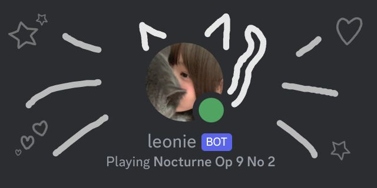

    
    

    <h1>leonie.js</h1>
    <b>Originally built to make lives easier</b>
    

<h2>About Leonie</h2>
Leonie is a Discord bot originally written for a small community.
It was built using the discord.js library.
Since we value open-source software, we decided to publish the code.